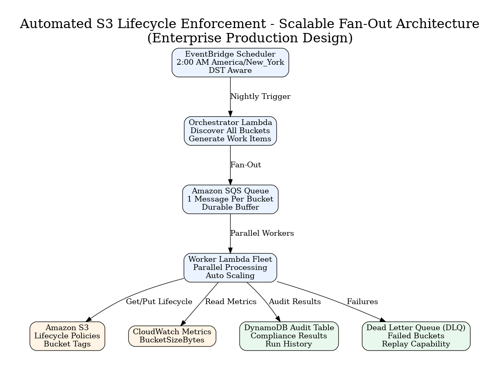

# Automated S3 Lifecycle Enforcement

## Purpose
Nightly AWS-native automation that audits S3 buckets and applies a standard lifecycle policy to buckets that are larger than 100GB, have no active lifecycle policy, and are not tagged `lifecycle-exempt=true`.

## Runtime Behavior
1. Enumerates all S3 buckets in the account.
2. Skips buckets with an active lifecycle policy.
3. Checks `lifecycle-exempt=true` bucket tag.
4. Reads CloudWatch `AWS/S3` `BucketSizeBytes` daily storage metric.
5. If the bucket is over 100GB, applies:
   - Standard-IA after 30 days
   - S3 Glacier Flexible Retrieval after 180 days
6. Logs all decisions with US/Eastern timestamps.


# Automated S3 Lifecycle Enforcement

## Executive Summary

Organizations often accumulate hundreds or thousands of Amazon S3 buckets that are never cleaned up or optimized after creation. As a result, storage costs increase because objects remain in expensive storage classes indefinitely.

This project implements a fully serverless AWS-native automation that:

* Audits every S3 bucket in the account
* Detects buckets missing lifecycle policies
* Skips exempt buckets using tags
* Uses CloudWatch storage metrics to identify large buckets
* Automatically applies a standard lifecycle policy
* Supports DRY_RUN mode for safe testing
* Logs all actions with US/Eastern timestamps
* Uses least-privilege IAM permissions
* Supports future fan-out redesign for enterprise scale

---

# Business Problem

Developers frequently create S3 buckets and never implement lifecycle management.

Consequences:

* Rising AWS storage costs
* Cold data remains in Standard storage
* No governance enforcement
* Manual auditing becomes operationally expensive

Goal:

Automatically enforce lifecycle policies on large unmanaged buckets without requiring human intervention.

---

# Architecture



## Workflow

1. EventBridge Scheduler triggers nightly at 2:00 AM America/New_York.
2. Lambda enumerates all buckets.
3. Existing lifecycle policies are detected and skipped.
4. Exemption tags are evaluated.
5. CloudWatch BucketSizeBytes metrics are queried.
6. Buckets larger than 100 GB are identified.
7. Lifecycle policy is applied.
8. All actions are logged to CloudWatch Logs.

---

# Lifecycle Policy Applied

Eligible buckets receive:

| Age       | Storage Class              |
| --------- | -------------------------- |
| 0-30 Days | Standard                   |
| 30+ Days  | Standard-IA                |
| 180+ Days | Glacier Flexible Retrieval |

Additional optimization:

* Abort incomplete multipart uploads after 7 days

---

# Solution Components

## EventBridge Scheduler

Runs nightly:

```hcl
schedule_expression = "cron(0 2 * * ? *)"
schedule_expression_timezone = "America/New_York"
```

Why?

* Handles Daylight Saving Time automatically
* No hardcoded UTC offsets
* Meets business requirement exactly

---

## AWS Lambda

The Lambda performs:

### Bucket Discovery

```python
s3.list_buckets()
```

### Lifecycle Detection

```python
s3.get_bucket_lifecycle_configuration()
```

### Exemption Validation

```python
s3.get_bucket_tagging()
```

### CloudWatch Metric Query

```python
cloudwatch.get_metric_statistics()
```

### Remediation

```python
s3.put_bucket_lifecycle_configuration()
```

---

# Decision Tree

For every bucket:

```text
Has Lifecycle Policy?
│
├── YES → Skip
│
└── NO
     │
     ├── lifecycle-exempt=true ?
     │
     ├── YES → Skip
     │
     └── NO
          │
          ├── BucketSizeBytes Available?
          │
          ├── NO → Skip
          │
          └── YES
                │
                ├── >100 GB ?
                │
                ├── NO → Skip
                │
                └── YES
                       │
                       └── Apply Lifecycle Policy
```

---

# DRY_RUN Safety Mode

Default:

```bash
DRY_RUN=true
```

Behavior:

```text
No changes made
Logs intended actions
Safe validation mode
```

Enable remediation:

```bash
terraform apply -var="dry_run=false"
```

---

# Why CloudWatch Instead of Listing Objects?

Many candidates attempt:

```python
list_objects_v2()
```

Problems:

* Slow
* Expensive
* Millions of API calls

Instead:

```python
BucketSizeBytes
```

Benefits:

* Already aggregated by AWS
* Low API cost
* Fast execution
* Scales significantly better

This is a key FinOps optimization.

---

# IAM Least Privilege

The Lambda is restricted to:

```text
s3:ListAllMyBuckets
s3:GetLifecycleConfiguration
s3:GetBucketTagging
s3:PutLifecycleConfiguration
cloudwatch:GetMetricStatistics
logs:CreateLogGroup
logs:CreateLogStream
logs:PutLogEvents
```

The Lambda cannot:

```text
Read objects
Delete objects
Delete buckets
Modify IAM
```

---

# Error Handling

Production safeguards include:

* Adaptive retry mode
* AWS API exception handling
* Timeout handling
* Per-bucket isolation
* Structured JSON logging

Example:

```python
except ClientError as exc:
```

One failing bucket does not stop the audit.

---

# Logging

All logs are structured JSON:

```json
{
  "timestamp_eastern": "2026-06-04T15:00:16-04:00",
  "bucket": "example-bucket",
  "action": "EXEMPT",
  "message": "Exempt — No Action Taken"
}
```

Benefits:

* CloudWatch Logs Insights compatible
* Auditable
* Searchable

---

# Terraform Deployment

Initialize:

```bash
terraform init
```

Plan:

```bash
terraform plan
```

Deploy:

```bash
terraform apply
```

---

# Testing Scenarios

## Bucket With Existing Lifecycle Policy

Expected:

```text
SKIPPED
```

---

## Exempt Bucket

Tag:

```bash
aws s3api put-bucket-tagging \
--bucket example-bucket \
--tagging 'TagSet=[{Key=lifecycle-exempt,Value=true}]'
```

Expected:

```text
EXEMPT
```

---

## Small Bucket (<100 GB)

Expected:

```text
SKIPPED_BELOW_THRESHOLD
```

---

## Large Bucket (>100 GB)

Expected:

```text
DRY_RUN
```

or

```text
REMEDIATED
```

---

# Scalability Discussion

Current implementation:

```text
EventBridge
    ↓
Single Lambda
    ↓
Sequential Processing
```

Suitable for:

```text
Hundreds of buckets
```

Potential limitation:

```text
15-minute Lambda timeout
```

---

# Enterprise Scale Redesign

For thousands of buckets:

```text
EventBridge Scheduler
           ↓
Orchestrator Lambda
           ↓
Amazon SQS
           ↓
Worker Lambda Fleet
           ↓
Parallel Processing
```

Benefits:

* Horizontal scalability
* Failure isolation
* DLQ support
* Retry capability
* No Lambda timeout risk

---

# FinOps Benefits

Storage cost reduction:

```text
Standard
      ↓
Standard-IA
      ↓
Glacier Flexible Retrieval
```

Expected outcomes:

* Reduced storage spend
* Automated governance
* Reduced operational overhead
* Improved compliance

---


## DRY_RUN Mode
Default is safe mode:

```bash
DRY_RUN=true
```

When `DRY_RUN=true`, the Lambda logs intended changes but does not call `PutBucketLifecycleConfiguration`.

## Deploy

```bash
cd terraform
terraform init
terraform plan
terraform apply
```

To enable remediation:

```bash
terraform apply -var='dry_run=false'
```

## Test

Invoke the Lambda manually first with `DRY_RUN=true`, then inspect CloudWatch Logs:

```bash
aws lambda invoke --function-name s3-lifecycle-enforcer output.json
cat output.json
```

Create an exempt bucket for testing:

```bash
aws s3api put-bucket-tagging \
  --bucket example-bucket \
  --tagging 'TagSet=[{Key=lifecycle-exempt,Value=true}]'
```

## Scale-Out Redesign
If serial iteration approaches Lambda's 15-minute timeout, redesign as a fan-out workflow:

1. Scheduler triggers an orchestrator Lambda or Step Functions state machine.
2. Orchestrator lists buckets and writes one work item per bucket to SQS.
3. Worker Lambda consumes SQS messages in parallel.
4. Each worker evaluates one bucket: lifecycle status, exemption tag, CloudWatch metric, remediation.
5. Use reserved concurrency to control API pressure.
6. Failed messages go to a DLQ for replay.
7. Aggregate results in DynamoDB or CloudWatch Embedded Metric Format.

This keeps each unit of work small, retryable, and horizontally scalable.
